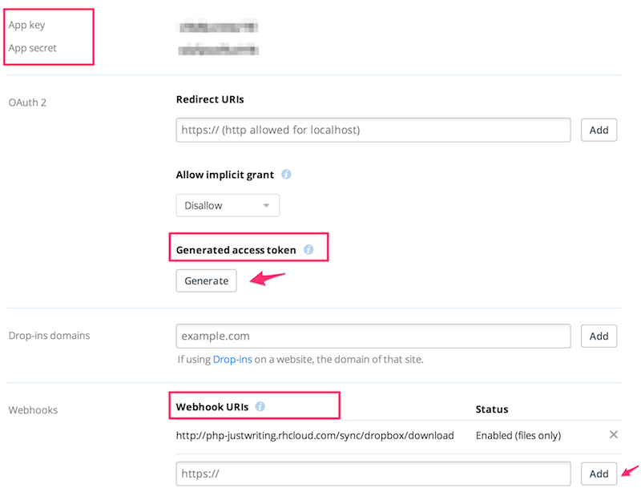

JustWriting
============

[](https://travis-ci.org/hjue/JustWriting)
[](https://packagist.org/packages/hjue/justwriting) [](https://packagist.org/packages/hjue/justwriting) [](https://packagist.org/packages/hjue/justwriting) [](https://packagist.org/packages/hjue/justwriting)

### Introduction

[**Justwriting**](https://github.com/hjue/JustWriting) is a simple blog platform. You just need the text written in Markdown, upload the .md file to website, and it will show .md files as posts on your website.

It can synchronize files to the server by Dropbox, so you don't have to care about losing your files when the server breaks, as all files can be stored on your local devices.

If you share the folder in Dropbox with others, all members can add or edit posts.

Of course, if you have problems to install Dropbox on servers, it also can upload files by FTP, SVN or git, or any other methods you can upload files with.

[Oneline Demo on SAE](http://justwriting.sinaapp.com/)

[Oneline Demo on OpenShift](http://php-justwriting.rhcloud.com/)


If you have any questions, feel free to [ask me](https://github.com/hjue/JustWriting/issues/new).

[中文版使用说明移步这里](https://github.com/hjue/JustWriting/blob/master/README.zh.md)


### Requirements

- PHP 5.3.6+

### Features

* Simple blog platform
* No need for an onlinetoc editor, just write your post offline on any device
* No need for a database
* Write with Markdown
* Supports code highlighting
* Supports Latex math equations
* Supports Toc
* Multiple themes
* Supports updates via Dropbox
* Supports post via API
* Supports Jekyll post file


### Installation

0. Set blog settings in 'settings.php'
0. Upload code to php space
0. Upload your Markdown files to the 'posts' folder
0. Open website, that's it.

### Deploy  With Docker

    docker pull hjue/justwriting

[JustWriting Docker Repo ](https://github.com/hjue/dockerfiles/tree/master/justwriting)


#### Web Server Configuration

* [Apache Setting](https://gist.github.com/hjue/4da6b1e897de31d135f7)
* [Nginx Setting](https://gist.github.com/hjue/647dc694dc3b67994202)


### Themes for JustWriting

* [rock](https://github.com/hjue/JustWriting/tree/master/templates/rock)
* [deepure](https://github.com/hjue/JustWriting/tree/master/templates/deepure)
* [simpleBlue](https://github.com/ncosnard/jw-theme-simpleBlue)
* [bmore](https://github.com/JellyBool/JustWriting-themes/tree/master/bmore)
* [Jelly](https://github.com/JellyBool/JustWriting-themes/tree/master/Jelly)


### Write Articles

#### Head information

Put the head information at the beginning of the .md file.

```Markdown
Date: 2014-12-31
Title: Post tilte
Intro: Post abstract
Tags: justwriting blog
Toc:yes
Status: public
Position: 1

Contents
```

The `status` can also be defined as `draft`, then this file will not appear on the website.

The `Toc` can control show the table of contents or not,accept yes or no.

It also supports Jekyll head information.

### Add Posts

As **Justwriting** will convert any .md file in the posts folder to post, so you just need upload `.md` file to the servers through any ways. Here list some methods:

#### 1. Sync with Dropbox client Automatically

If running **Justwriting** on VPS, suggest to update post through Dropbox. [Installation Process](https://github.com/hjue/JustWriting/wiki/%E4%BD%BF%E7%94%A8Dropbox%E5%92%8CJustwriting%E6%90%AD%E5%BB%BA%E4%B8%AA%E4%BA%BA%E5%8D%9A%E5%AE%A2)。

#### 2. Sync with Dropbox webhook URL

For virtual host user, it may not able to install Dropbox client, **JustWritting** provide a function to manually pull files from Dropbox.

 1. [ Create App ](https://www.dropbox.com/developers/apps)

*  Generate access token
*  Add Webhook URI  `http://<your_justwriting_site>/sync/dropbox/download`


 

 2. Configure params in settings.php:

```PHP
$blog_config['dropbox']['key'],
$blog_config['dropbox']['secret'],
$blog_config['dropbox']['access_token']
```

>  [http://your_justwriting_site/sync/dropbox/download ](http://your_justwriting_site/sync/dropbox/download ) is the URL for syncing posts


#### 3. Through API

Justwriting supports post through API.

If use the API, it need true on the option in settings.php, and set the API Key in it.

Click here to check the [API documents](https://github.com/hjue/JustWriting/wiki/API)

### Who uses JustWriting?

* [hjue](http://www.hjue.me)
* [JellyBool](http://www.jellybool.com/)
* [Colin](http://doc.mekesim.com/)
* [周渊](http://blog.zhouyuan11.cn/)
* [花开堪折枝](http://yaming.coding.io/)
* [Jings](http://nsaos.com/)
* [Tictech](http://tictech.info/)
* [海棠红叶](http://www.htredleaf.com/)

  If you are using Justwriting, and would like to be listed here, [tell me](https://github.com/hjue/JustWriting/issues/new).


### Contributors

* [xieyu33333](https://github.com/xieyu33333)
* [mekesim](https://github.com/mekesim)

## License

Please see the file called LICENSE.
