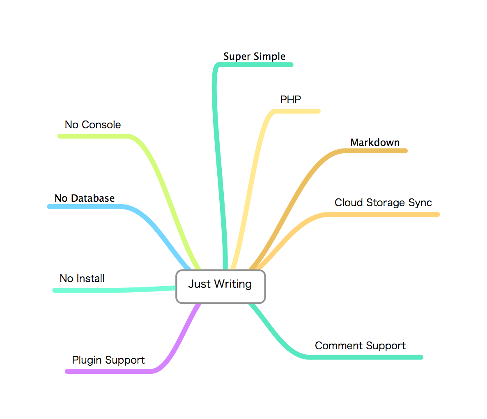

JustWritting
============

JustWritting is a Super simple Blog engine.

### Requirements

- PHP 5.3.6+

To determine your PHP version, create a new file with this PHP code: `<?php echo PHP_VERSION; // version.php`. This will print your version number to the screen.

### Features

- Super Simple
- No Database
- Markdown Formatting
- Twig Templates
- Open Source

### Install

1. 上传源代码到你的PHP空间。目前支持SAE。
2. 将markdown文档放到posts目录中

### ToDo List

- 支持微盘同步(Sina网盘) 
Vdisk暂时无法支持了，除非申请basic访问权限。Vdisk的App沙箱中的文件居然不出现在用户的微盘中，微盘为什么要这么设计？多学学Dropbox的设计吧。
[Vdisk文档参见这里](http://vdisk.weibo.com/developers/index.php?module=api&action=rights#space)

- Dropbox

- 百度网盘

### Contributors

- [xieyu33333](https://github.com/xieyu33333)

### Online Demo

[Online Demo](http://justwriting.sinaapp.com/)

## License

MIT